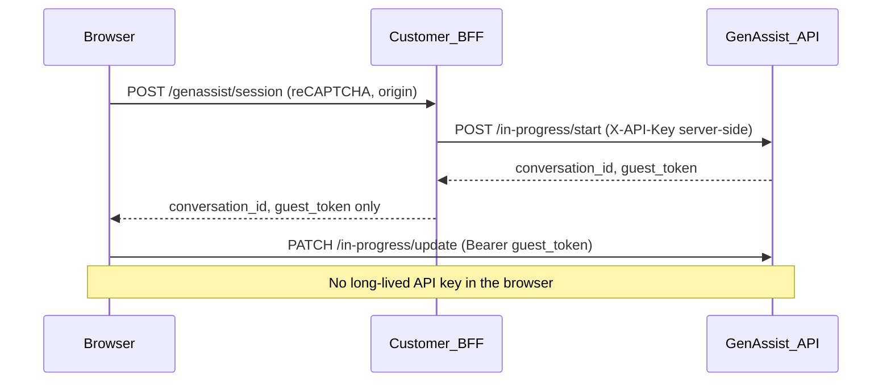

# Public embed and backoffice API key security (FG-1)

GenAssist chat widgets and embedded clients cannot keep API keys secret in the browser. Any credential shipped in HTML, JavaScript, or CSS is public to visitors, operators, extensions, and third-party scripts on that origin.

This guide describes the supported integration pattern and a PayByPhone-style deployment checklist.

## Supported architecture



### GenAssist controls (enable per agent)

In **AI Agents → Security** (or API):

| Setting | Purpose |
|---------|---------|
| `token_based_auth` | After start, reject bare API keys on update/poll/WS; require guest JWT |
| `token_expiration_minutes` | Short-lived guest tokens |
| `recaptcha_enabled` | Bot protection on start/update |
| `cors_allowed_origins` | Limit browser origins (e.g. `https://support.example.com`) |
| Rate limits | Throttle start/update abuse |

### API key hygiene

- Use the **ai agent** role only (`create` / `update` / `read:in_progress_conversation`).
- Do **not** grant `read:conversation` on public embed keys.
- Set **`expires_in_days`** (30–90) and rotate after pipeline changes.
- Use **separate keys** per surface (help-center vs backoffice).

### Platform enforcement (GenAssist backend)

- `GET /api/conversations/{id}` requires `read:conversation`.
- In-progress **poll/update** reject bare API keys without `read:conversation`; callers must use a **guest JWT** scoped to `conversation_id`.
- WebSocket verification accepts guest tokens and binds them to the conversation room.

## PayByPhone deployment checklist (P0)

Apply in the Southern Cross monorepo (not in this repository):

1. **Remove API keys from build inputs** — stop baking `apps/<surface>/env/{dev,int,cons,prod}.json` into webpack/Vite bundles.
2. **Help-center widget** — ship only `widget.iife.js` + `widget.css` from [plugin-js](../../plugins/plugin-js/BUILD.md); set `window.GENASSIST_CONFIG` at page render (Zendesk template), without `apiKey` once BFF exists.
3. **Rotate** help-center and backoffice keys after the pipeline change.
4. **Enable agent security** on production help-center agent: `token_based_auth`, reCAPTCHA, strict CORS, rate limits.
5. **Set key expiry** on replacement keys in GenAssist admin.
6. **Backoffice interim** — treat embedded chat as high risk until per-operator BFF exists; restrict to VPN/internal network if needed.

## BFF session endpoint (P1)

PayByPhone should implement a small backend (Azure Function, API gateway, or existing BFF) that:

1. Validates reCAPTCHA and allowed origin.
2. Calls GenAssist with the server-held API key:

```http
POST {GENASSIST_BASE}/api/conversations/in-progress/start
X-API-Key: {SERVER_KEY}
Content-Type: application/json

{"messages": [], "operator_id": "...", "data_source_id": "...", "recaptcha_token": "..."}
```

3. Returns only `{ "conversation_id", "guest_token" }` to the browser.

4. Configures the widget with `baseUrl`, `tenant`, reCAPTCHA site key — **not** the GenAssist API key.

Example (Node/Express sketch):

```javascript
app.post("/genassist/session", async (req, res) => {
  const { recaptchaToken } = req.body;
  // validate recaptcha + origin ...
  const start = await fetch(`${process.env.GENASSIST_URL}/api/conversations/in-progress/start`, {
    method: "POST",
    headers: {
      "Content-Type": "application/json",
      "X-API-Key": process.env.GENASSIST_API_KEY,
      "x-tenant-id": process.env.GENASSIST_TENANT,
    },
    body: JSON.stringify({
      messages: [],
      operator_id: process.env.GENASSIST_OPERATOR_ID,
      data_source_id: process.env.GENASSIST_DATA_SOURCE_ID,
      recaptcha_token: recaptchaToken,
    }),
  });
  const data = await start.json();
  res.json({
    conversation_id: data.conversation_id,
    guest_token: data.guest_token,
  });
});
```

Wire the widget by setting `guest_token` on the chat client after start (via `GenassistBootstrap` / chat hook) or extend your loader to call the BFF before bootstrap.

## Backoffice operator attribution (P2 / FG-3)

A shared backoffice API key in static bundles cannot attribute actions to individual operators.

**Target pattern:**

1. Browser sends the PayByPhone operator SSO token to a **backoffice BFF**.
2. BFF validates SSO, maps `sub` → operator identity, and proxies GenAssist calls with:
   - Server-held integration credentials, and
   - Audit metadata (`operator_id`, `email`) on each request or a per-operator GenAssist service account (future).

Until that exists, prefer the GenAssist admin UI (JWT login) for operator workflows instead of embedding chat with a shared key.

## References

- [plugin-js README](../../plugins/plugin-js/README.md) — embed configuration
- [SECURITY.md](../../SECURITY.md) — reporting and contributor practices
- [websocket standalone service](../websocket-standalone-service.md) — WS verify-token with `conversation_id`
